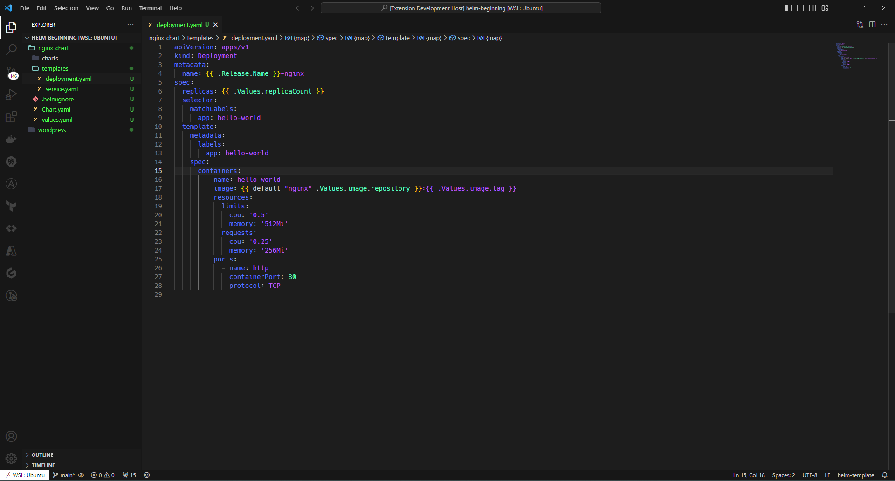
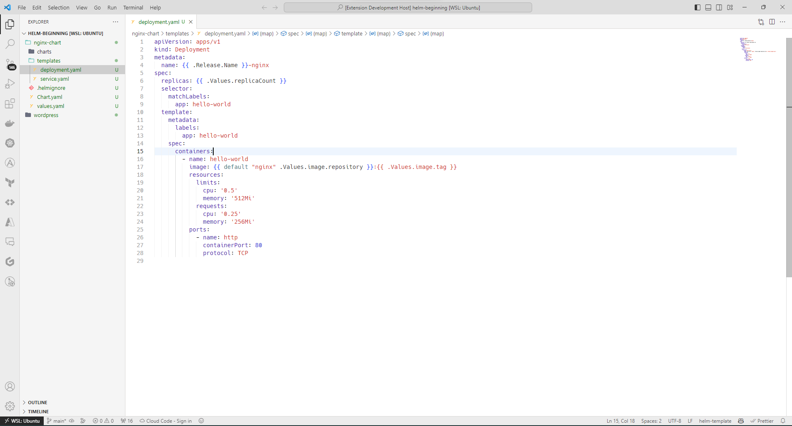

    <h1><code>🐴</code> Dullahan</h1>
    
A Dullahan theme for VS Code

    

## `📸` Screenshots

### `🌙` Dark

### `🌞` Light

## `📦` Installation

1. Open the **Extensions** sidebar in VS Code
2. Search for `Dullahan`
3. Click **Install**
4. Open the **Command Palette** with `Ctrl+Shift+P` or `⇧⌘P`
5. Select **Preferences: Color Theme** and choose a Dullahan variant
6. Enjoy! 🎉 Also, check out some of the personalization options below...

## `⚖️` License

Released under the [MIT License](LICENSE)
